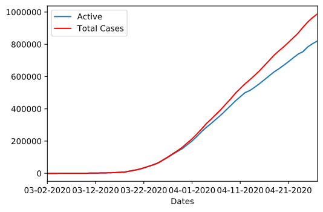

# COVID-19 Prediction

This is a class project for Advanced Techniques in Data Science. It uses linear, lasso, and ridge regression to predict the active cases of COVID-19 in the US. It uses the features confirmed, deaths, and recovered.

The data is from the [Johns Hopkins University Center for Systems Science and Engineering](https://github.com/CSSEGISandData/COVID-19).

**Here is an example of the active vs total cases in the US as of 4/27/20**

